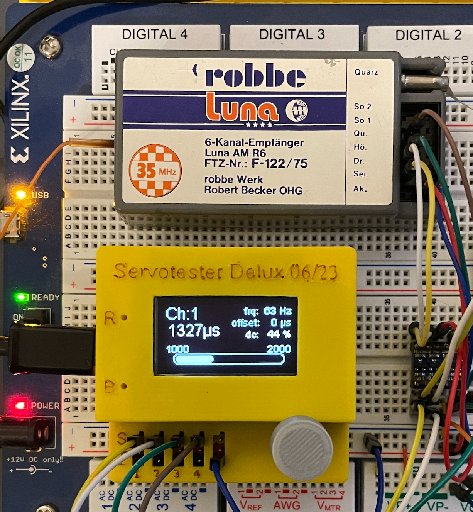
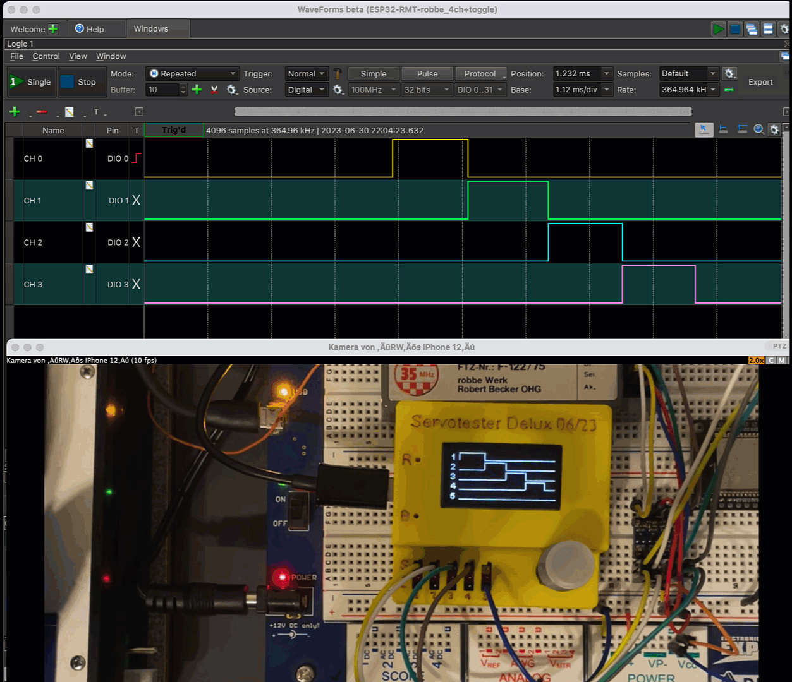

# Servotester_Deluxe (with improved software) and my own rmt_pwm_reader

The original autor is "Der RC Modellbauer": https://www.youtube.com/@DerRCModellbauer

The project was significantly expanded by "TheDIYGuy999": https://github.com/TheDIYGuy999/Servotester_Deluxe

forked from his GitHub: https://github.com/TheDIYGuy999/Servotester_Deluxe

**Note**<br>
This fork is only used as an example for the implementation of the [esp32-rmt-pwm-reader lib](https://github.com/rewegit/esp32-rmt-pwm-reader).<br>
**It will not be developed further here**.

All changes relate to the PWM pulses menu item.
The channel display has been changed. The following values are now displayed:

- Channel number 1-5
- Current pulse width in us
- Status (NOT CONNECTED, UNSTABLE) 
- If the signal is stable (STABLE) the progress bar is displayed.
- Within the first 5 seconds after activating a channel, the min/max value of the channel can be calibrated by moving the corresponding control unit to its exposition positions. The displayed values Pulse_min / Pulse_max are then adjusted accordingly and displayed left/right above the progress bar.
- PWM frequency in Hz of the channel, can be different per channel
- Offset us (phase shift between the current channel and channel 1) or 0 if the current channel does not have the same frequency as channel 1.
- Duty Cycle in % based on the actual measured values (if the channel was calibrated) or the default values min=1000 max=2000

If the control knob is turned further to the right after channel 5, a graphical display of all 5 channels is shown in real time. 
With this display the stability (jitter) of the channels and the position of the individual channels to each other (offset) as well as the reaction speed can be easily assessed. 
To make maximum use of the tiny screen area, the maximum width of the graphic is adjusted dynamically.  

For the rest of the functionality of the servo tester I refer to the original version.
https://github.com/TheDIYGuy999/Servotester_Deluxe 

## new menu

Ch:1 no min/max determination


Ch:1 after min/max determination


Ch: 1-4 with moved control sticks 

## Implementation
Since PWM pulse is only one functionality of the tester and the used pins have other tasks for other functions, the setup for the function is done when calling the menu function **Impuls_lesen_Menu**. 

```cpp
//  case Impuls_lesen_Menu:
if (!SetupMenu) {  // setup pwm_reader
    // setup pwm lib
    pwm_reader_init(servopin, numberOfChannels);

    // here you can change channel defaults before reading (if needed)
    // e.g. pwm_set_channel_pulse_min() /max/neutral/auto_zero/auto_min_max
    // But in this case i think it is better to measure min/max automatically continuously
    for (int channel = 0; channel < numberOfChannels; channel++) {
        pwm_set_failsafe(channel, false);  // The tester should show the real data. In this case failsafe makes no sense.

// for auto calibration neutral position set #define AUTO_ZERO_CALIBRATION true
#if AUTO_MIN_MAX_CALIBRATION == false                         // for auto measured min/max
        pwm_set_channel_pulse_min(channel, PULSE_MAX_VALID);  // Correct values are measured automatically
        pwm_set_channel_pulse_max(channel, 0);                // Correct values are measured automatically
#endif
    }
    // begin reading
    pwm_reader_begin();

    // end prepare pwm reading ----------------------------------------------------
    SetupMenu = true;
}
```
The code for the display output can be taken directly from the source.<br>
The overview page of all channels was realized with the line commands of the display lib, where the respective length directly reflects the PWM values.<br> 
There is a scaling to the display size. 
To make full use of the small display the maximum offset+pulse is calculated in advance. 

When the PWM read function is terminated with a long key press, the pwm_cleanup() is called, which frees all used resources and sets the pins to the default values

```cpp
if (buttonState == 1) {
    // cleanup
    esp_err_t err = (pwm_cleanup());
    if (err != ESP_OK) {
        Serial.printf("pwm_cleanup() err: %i", err);
    }

    Menu = Impuls_lesen_Auswahl;
    SetupMenu = false;
    selectedServo = 0;
}
```

Support thread (in German and English): https://www.rc-modellbau-portal.de/index.php?threads/servotester-deluxe-von-der-rc-modellbauer-mit-meiner-erweiterten-software.17383/

## How to program it
- With Arduino IDE
- With Visual Studio Code (recommended)
